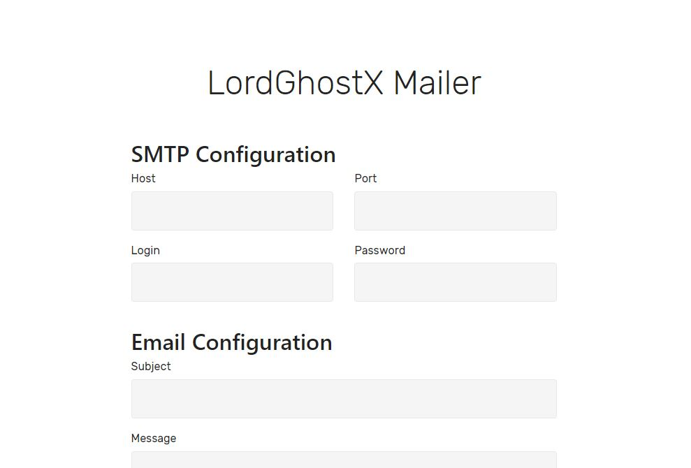
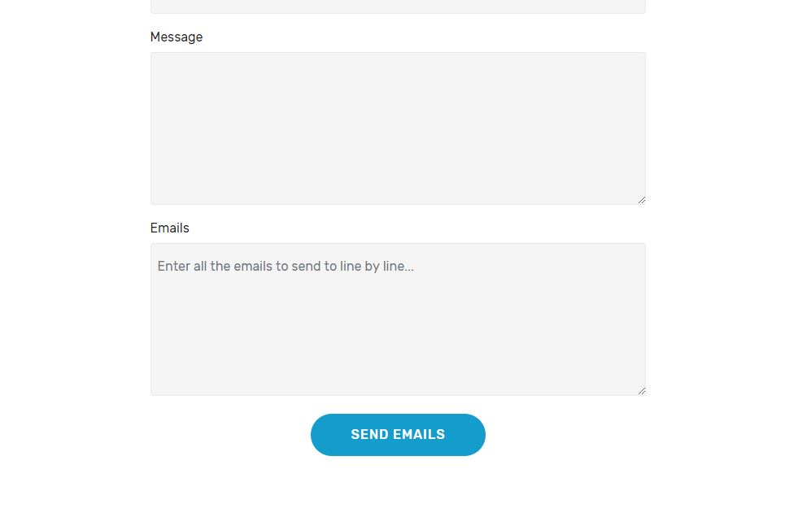

# MASS Mailer

This is a very simple bulk email sender (client), implemented in Python and Eel. It sends an email message (by given HTML template) to a list of recipients given in the form separated by new line, with simple mail-merge functionality which you have to specify with {MAIL} in the HTML.

This software is for general use. It is intended for end-users, and features a beautiful GUI.

## Goals

The goal of this software is to send reliably bulk emails (e.g. 10,000 emails) without using MailChimp or similar email marketing software. Sending thousands of emails will not work for most email providers (like Office 365 and GMail). It will say "stop, are you a spammer?". Registering your own SMTP server or using an SMTP from sites like MailJet + mail client like Outlook / Thunderbird / Evolution + mail merge will do the job, but most emails will be marked as spam. This is because you send too aggressively, e.g. 10,000 emails in 5 minutes. Best results come when you send emails one by one with 5-30 seconds delay after each mail sends. This is what this software does.

## How to Use It?

1. Setup an SMTP server (be sure to configure correctly the SPF records for your domain + reverse DNS + others). Or purchase SMTP from MailGun / MailJet / other.
Setup your email template HTML file.
2. Prepare your target emails.
3. Fill the mail form with all your details.
4. Run the app and wait. It takes time (intentionally). I run this in the night.

